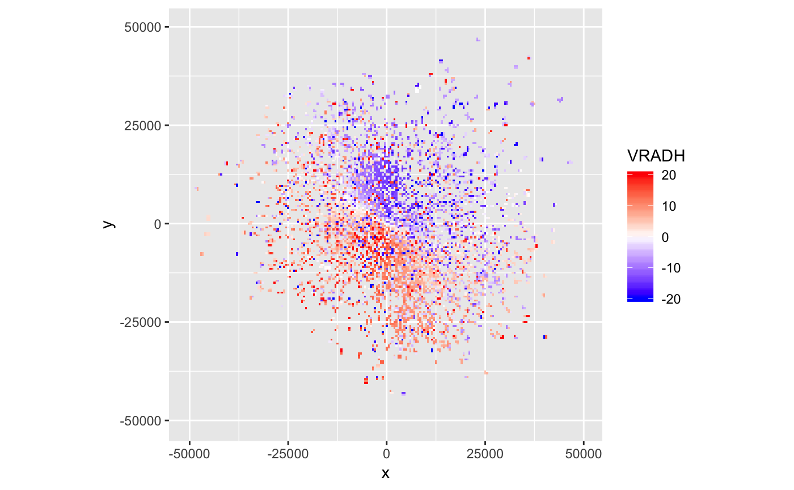
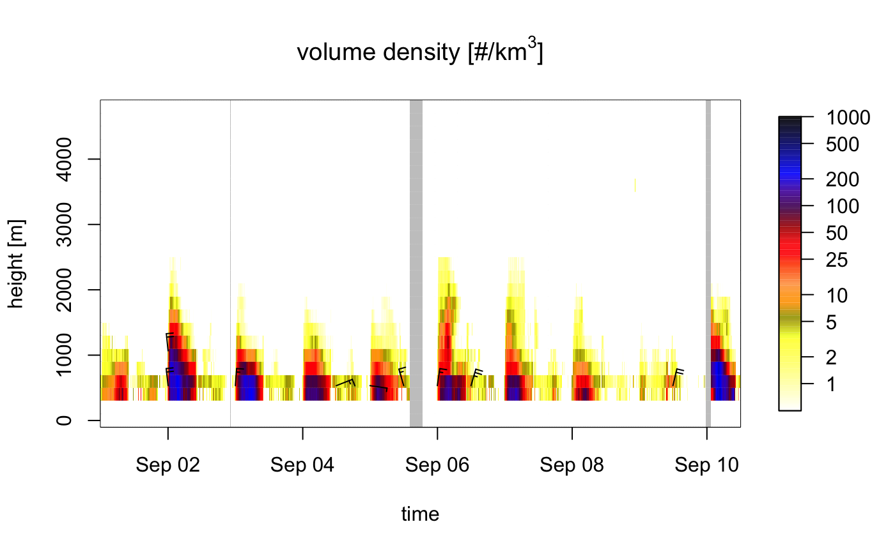
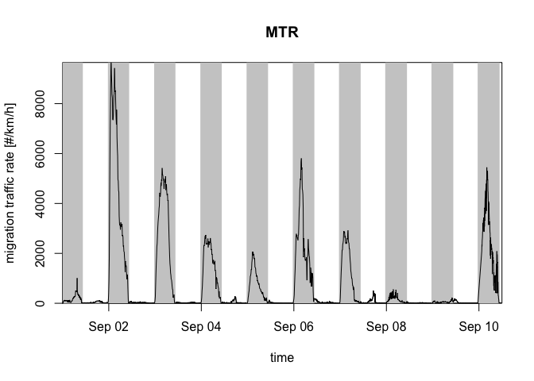

<!-- README.md is generated from README.Rmd. Please edit that file and knit with devtools::build_readme() -->

# bioRad 

<!-- badges: start -->

[](https://cran.r-project.org/package=bioRad)
[](https://github.com/adokter/bioRad/actions)
[](https://app.codecov.io/gh/adokter/bioRad)
[](https://doi.org/10.5281/zenodo.3370004)
<!-- badges: end -->

bioRad provides standardized methods for extracting and reporting
biological signals from weather radars. It includes functionality to
inspect low-level radar data, process these data into meaningful
biological information on animal speeds and directions at different
altitudes in the atmosphere, visualize these biological extractions, and
calculate further summary statistics.

To get started, see:

-   [Dokter et al. (2019)](https://doi.org/10.1111/ecog.04028): a paper
    describing the package.
-   [bioRad
    vignette](https://adriaandokter.com/bioRad/articles/bioRad.html): an
    introduction to bioRad’s main functionalities.
-   [Function
    reference](https://adriaandokter.com/bioRad/reference/index.html):
    an overview of all bioRad functions.
-   [Introductory
    exercises](https://adriaandokter.com/bioRad/articles/rad_aero_19.html):
    a tutorial with code examples and exercises.

More vignettes:

-   [Range
    correction](https://adriaandokter.com/bioRad/articles/range_correction.html):
    estimate spatial images of vertically integrated density corrected
    for range effects.

Documentation for the latest development version can be found
[here](https://adriaandokter.com/bioRad/dev/).

## Installation

### Install system libraries

For OS X and Linux the GNU Scientific Library (GSL), PROJ and HDF5
libraries need to be installed as system libraries prior to
installation, which are required by dependency package
**[vol2birdR](https://adriaandokter.com/vol2birdR/)**:

| System                                      | Command                                                           |
|:--------------------------------------------|:------------------------------------------------------------------|
| **OS X (using Homebrew)**                   | `brew install hdf5 proj gsl`                                      |
| **Debian-based systems (including Ubuntu)** | `sudo apt-get install libhdf5-dev libproj-dev gsl-bin libgsl-dev` |
| **Systems supporting yum and RPMs**         | `sudo yum install hdf5-devel proj-devel gsl gsl-devel`            |

<details>
<summary>
Additional required system libraries on Linux (Ubuntu)
</summary>

The following system libraries are required before installing bioRad on
Linux systems. In terminal, install these with:

    sudo apt install libcurl4-openssl-dev
    sudo apt install libssl-dev
    sudo apt install libgdal-dev

</details>

<br>

### Install bioRad

You can install the released version of bioRad from
[CRAN](https://CRAN.R-project.org) with:

``` r
install.packages("bioRad")
```

Alternatively, you can install the latest development version from
[GitHub](https://github.com/adokter/bioRad) with:

``` r
# install.packages("devtools")
devtools::install_github("adokter/bioRad")
```

Then load the package with:

``` r
library(bioRad)
#> Welcome to bioRad version 0.7.0.9522
#> using vol2birdR version 0.1.1.9913 (MistNet not installed)
```

### (optional) Enable MistNet

To enable MistNet, the following vol2birdR commands should be executed:

``` r
vol2birdR::install_mistnet()
vol2birdR::install_mistnet_model()
```

Read the [vol2birdR
documentation](https://adriaandokter.com/vol2birdR/articles/vol2birdR.html)
for more details.

## Usage

### Radar data example

bioRad can read weather radar data (= polar volumes) in the
[`ODIM`](http://eumetnet.eu/wp-content/uploads/2017/01/OPERA_hdf_description_2014.pdf)
format and formats supported by the [RSL
library](https://trmm-fc.gsfc.nasa.gov/trmm_gv/software/rsl/), such as
NEXRAD data. NEXRAD data (US) are [available as open
data](https://www.ncdc.noaa.gov/nexradinv/) and on
[AWS](https://registry.opendata.aws/noaa-nexrad/).

Here we read an example polar volume data file with `read_pvolfile()`,
extract the scan/sweep at elevation angle 3 with `get_scan()`, project
the data to a plan position indicator with `project_as_ppi()` and plot
the *radial velocity* of detected targets with `plot()`:

``` r
library(tidyverse) # To pipe %>% the steps below
system.file("extdata", "volume.h5", package = "bioRad") %>%
  read_pvolfile() %>%
  get_scan(3) %>%
  project_as_ppi() %>%
  plot(param = "VRADH") # VRADH = radial velocity in m/s
```



*Radial velocities towards the radar are negative, while radial
velocities away from the radar are positive, so in this plot there is
movement from the top right to the bottom left.*

### Vertical profile data example

Weather radar data can be processed into vertical profiles of biological
targets using `calculate_vp()`. This type of data is [available as open
data](https://aloftdata.eu) for over 100 European weather radars.

Once vertical profile data are loaded into bioRad, these can be bound
into time series using `bind_into_vpts()`. Here we read an example time
series, project it on a regular time grid with `regularize_vpts()` and
plot it with `plot()`:

``` r
example_vpts %>%
  regularize_vpts() %>%
  plot()
#> projecting on 300 seconds interval grid...
```



*The gray bars in the plot indicate gaps in the data.*

The altitudes in the profile can be integrated with
`integrate_profile()` resulting in a dataframe with rows for datetimes
and columns for quantities. Here we plot the quantity *migration traffic
rate* (column `mtr`) with `plot()`:

``` r
my_vpi <- integrate_profile(example_vpts)

plot(my_vpi, quantity = "mtr") # mtr = migration traffic rate
```



To know the total number of birds passing over the radar during the full
time series, we use the last value of the *cumulative migration traffic*
(column `mt`):

``` r
my_vpi %>%
  pull(mt) %>% # Extract column mt as a vector
  last()
#> [1] 129491.5
```

For more exercises, see [this
tutorial](https://adriaandokter.com/bioRad/articles/rad_aero_19.html).

## Meta

-   We welcome
    [contributions](https://adriaandokter.com/bioRad/CONTRIBUTING.html)
    including bug reports.
-   License: MIT
-   Get citation information for `bioRad` in R doing
    `citation("bioRad")`.
-   Please note that this project is released with a [Contributor Code
    of Conduct](https://adriaandokter.com/bioRad/CODE_OF_CONDUCT.html).
    By participating in this project you agree to abide by its terms.
