# Correction for range effects

## 1 Preparations

Load bioRad

``` r

options("sp_evolution_status" = 2L)
library(bioRad)
```

    ## Welcome to bioRad version 0.11.0.9000

    ## using vol2birdR version 1.2.1 (MistNet not installed)

## 2 Beam propagation

We start with the changing properties of the radar beam as it propagates
through the atmosphere. We define:

- **range**: the length of the skywave path between target and the radar
  antenna, also known as *slant range*
- **distance**: the distance of the target from the radar as measured
  along the earth’s surface, also known as *down range*.

The beam height is changing as a result of earth’s curvature, and beam
refraction:

``` r

# define a range grid from 0 to 200 km:
my_range <- seq(0, 200000, 1000)
# plot the beam height for each range, for a 0.5 degree elevation beam:
plot(my_range, beam_height(my_range, elev = .5), xlab = "range [m]", ylab = "beam height [m]")
```

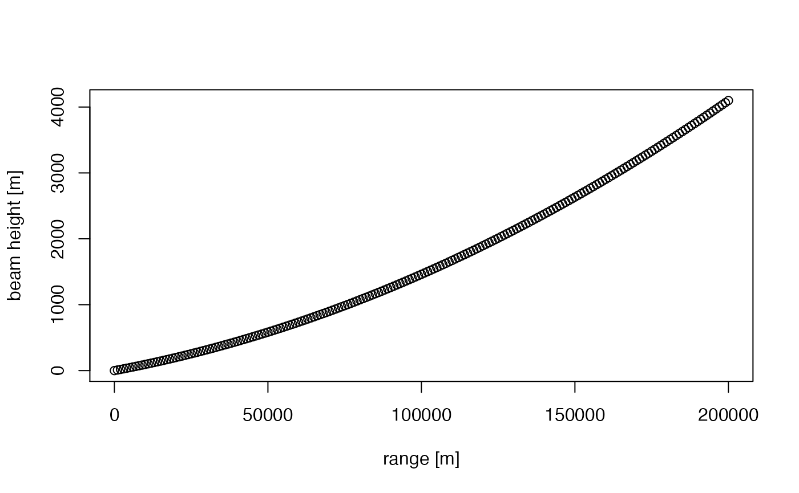

The beam width also broadens with range:

``` r

# plot the beam width, for a beam opening angle of 1 degree (typical for most weather radars):
plot(my_range, beam_width(my_range, beam_angle = 1), xlab = "range [m]", ylab = "beam width [m]")
```

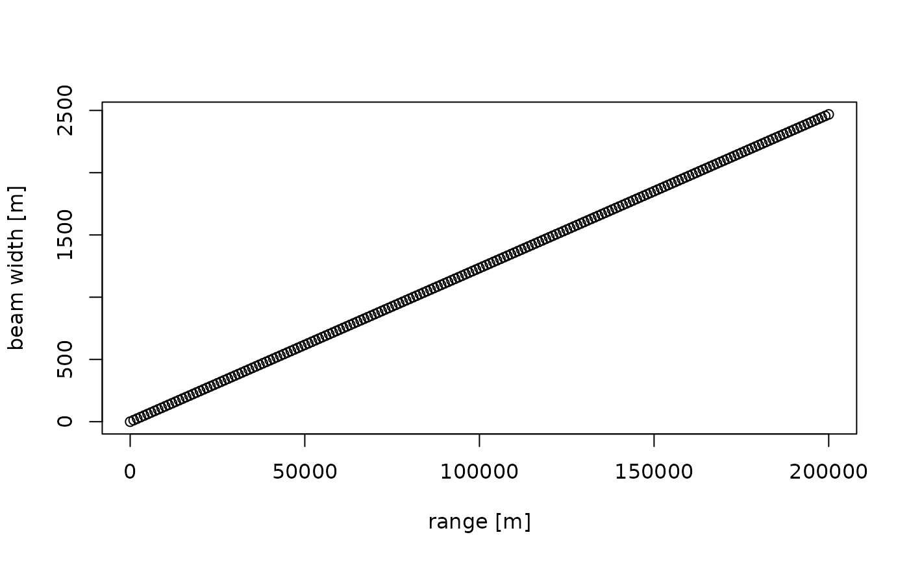

We can now combine the relations for beam width and beam height, to
calculate the beam profile as a function of height, i.e. the altitudinal
normalized distribution of radiated energy by the beam. Let’s plot the
radiation profile for a 0.5 and 2 degree beam elevation at 50 km from
the radar (the height axis runs from ground level straight up):

``` r

# plot the beam profile, for a 0.5 degree elevation beam at 50 km distance from the radar:
plot(beam_profile(height = 0:4000, 50000, 0.5), 0:4000, xlab = "normalized radiated energy", ylab = "height [m]", main = "beam elevation: 0.5 deg, distance=50km")
```

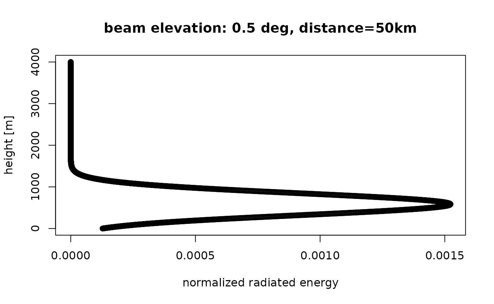

``` r

# plot the beam profile, for a 2 degree elevation beam at 50 km distance from the radar:
plot(beam_profile(height = 0:4000, 50000, 2), 0:4000, xlab = "normalized radiated energy", ylab = "height [m]", main = "beam elevation: 2 deg, distance=50km")
```

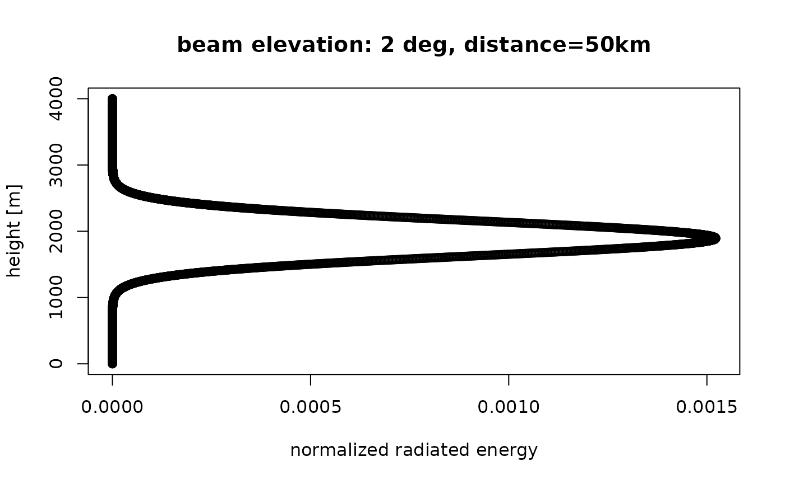

We can also calculate the normalized radiation profile for the two beams
combined:

``` r

# plot the combined beam profile for a 0.5 and 2.0 degree elevation beam at 50 km distance from the radar:
plot(beam_profile(height = 0:4000, 50000, c(0.5, 2)), 0:4000, xlab = "normalized radiated energy", ylab = "height [m]", main = "beam elevations: 0.5,2 deg, distance=50km")
```

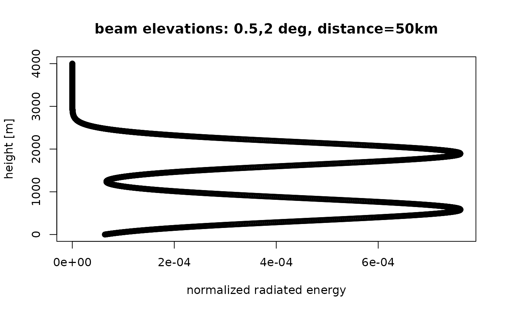

## 3 Vertical profiles and polar volumes

Let us now assume we have calculated a vertical profile (of birds) for a
certain polar volume file. Let’s load an example

``` r

# let's load an example polar volume:
pvolfile <- system.file("extdata", "volume.h5", package = "bioRad")
example_pvol <- read_pvolfile(file = pvolfile)
# a vertical profile can also be calculated from the polar volume directly, using
# calculate_vp(pvolfile)
# but for now we will use bioRad's example vertical profile already calculated:
example_vp
```

    ##                Vertical profile (class vp)
    ## 
    ##        radar:  seang 
    ##       source:  WMO:02606,RAD:SE50,PLC:Ängelholm,NOD:seang,ORG:82,CTY:643,CMT:Swedish radar 
    ## nominal time:  2015-10-18 18:00:00 
    ## generated by:  vol2bird 0.3.17

Let’s plot the vertical profile, for the quantity eta (the linear
reflectivity):

``` r

plot(example_vp, quantity = "eta")
```

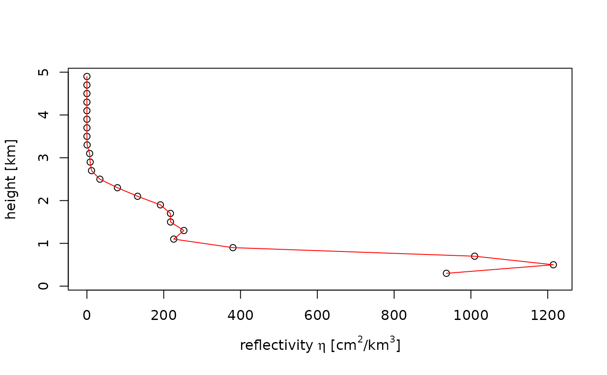

Note that eta is directly related to reflectivity factor (DBZH), i.e. a
reflectivity factor of 5 dBZ amounts to the following eta at a radar
wavelength of 5.3 cm:

``` r

dbz_to_eta(5, wavelength = 5.3)
```

    ## [1] 1140.588

## 4 Spatial estimates of vertically integrated density (VID)

Our goal is to estimate a spatial image of vertically integrated density
(VID) based on all elevation scans of the radar, while accounting for
the changing overlap between the radar beams as a function of range.

We start with:

- a polar volume, containing multiple scans
- a vertical profile (of birds) calculated for that polar volume
- a grid that we define relative to the earth’s surface, on which we
  will calculate the range corrected image. The pixel locations on the
  ground are easily translated into a corresponding azimuth and range of
  the various scans (see function
  [`beam_range()`](http://adriaandokter.com/bioRad/dev/reference/beam_range.md)).

For each scan within the polar volume we:

- calculate for each ground surface pixel the vertical radiation profile
  at that pixel for that particular scan, following above paragraph 2.
- calculate the reflectivity we expect at that pixel
  ($`eta_{expected}`$), given the vertical profile (of birds) and the
  part of the profile radiated by the beam. This $`eta_{expected}`$ is
  simply the average of (linear) eta in the profile (as plotted in
  paragraph 3 above), weighted by the vertical radiation profile (as
  plotted in paragraph 2).
- we also calculated the observed eta at this pixel, which is simply
  given by `dbz_to_eta(DBZH)` (see paragraph 3), with DBZH the
  reflectivity factor measured at the pixel’s distance from the radar.

For each pixel on the ground, we thus end up with a set of
$`eta_{expected}`$ and a set of $`eta_{observed}`$. From those we can
calculate a correction factor at that pixel, as
$`R=\sum{eta_{observed}}/\sum{eta_{expected}}`$, with the sum running
over scans.

To arrive at the final PPI image:

- we calculate the vertically integrated density (`vid`) and vertically
  integrated reflectivity (`vir`) for the profile, using the function
  [`integrate_profile()`](http://adriaandokter.com/bioRad/dev/reference/integrate_profile.md).
- the spatial range-corrected PPI for `VID` is simply the adjustment
  factor image (`R`), multiplied by the `vid` calculated for the profile
- Likewise, the spatial range-corrected PPI for `VIR` is simply the `R`
  image, multiplied by the `vir` calculated for the profile

## 5 Example: estimating a VID image

Let’s first make a PPI plot of the lowest uncorrected scan:

``` r

# extract the first scan from the polar volume:
my_scan <- example_pvol$scans[[1]]
# project it as a PPI on the ground:
my_ppi <- project_as_ppi(my_scan, range_max = 100000)
# plot it
plot(my_ppi)
```

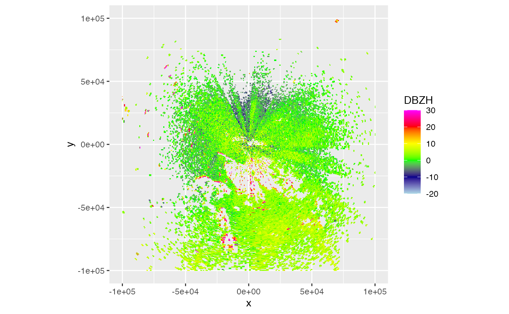

Now let’s calculate the range-corrected PPI

``` r

# let's use a 500 metre spatial grid (res), and restrict to 100x100 km area
my_corrected_ppi <- integrate_to_ppi(example_pvol, example_vp, res = 500, xlim = c(-100000, 100000), ylim = c(-100000, 100000))
my_corrected_ppi
```

    ##                Plan position indicator (class ppi)
    ## 
    ##   parameters:  VIR VID R overlap eta_sum eta_sum_expected 
    ##         dims:  400 x 400 pixels

The range corrected PPI has four parameters: VIR, VID, R, overlap. Let’s
plot the adjustment factor R:

``` r

# plot the adjustment factor R:
plot(my_corrected_ppi, param = "R")
```

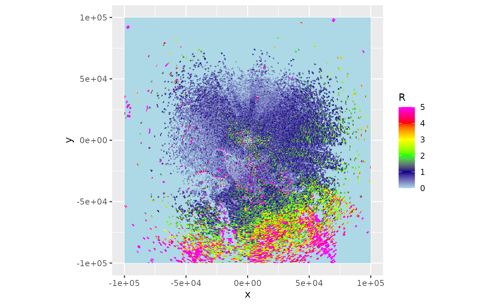

Let’s also plot the vertically integrated reflectivity:

``` r

plot(my_corrected_ppi, param = "VIR")
```

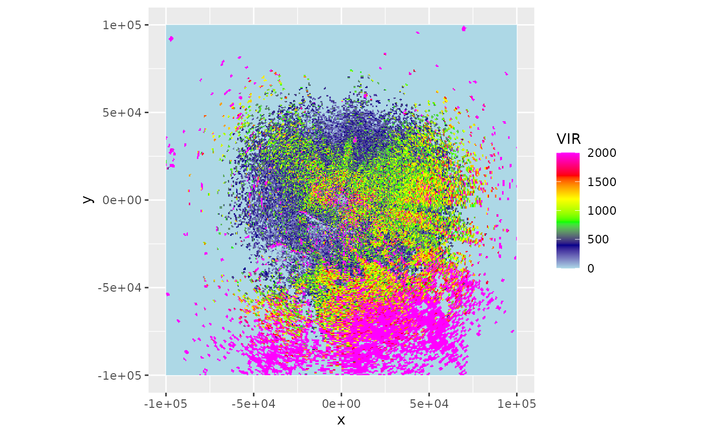

Or plot the vertically integrated density on a map:

``` r

bm <- "osm"
if (all(sapply(c("ggspatial","prettymapr", "rosm"), requireNamespace, quietly = TRUE))){
   map(my_corrected_ppi, map=bm, param = "VIR", alpha = .5)
}
```

    ## Zoom: 7

    ## Fetching 4 missing tiles

    ##   |                                                                              |                                                                      |   0%  |                                                                              |==================                                                    |  25%  |                                                                              |===================================                                   |  50%  |                                                                              |====================================================                  |  75%  |                                                                              |======================================================================| 100%

    ## ...complete!

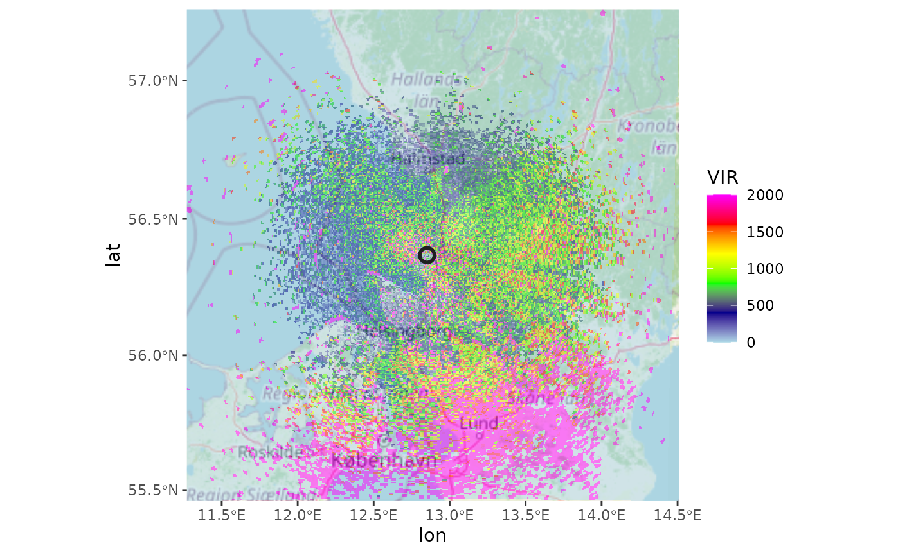

## 6 Overlap between radiation profile and bird profile

At large distances from the radar we expect correction for range effects
to become more difficult:

1.  radar beams start to overshoot the aerial layers with biology,
    i.e. the overlap between the vertical profile and the emitted
    radiation profile decreases
2.  at large distances weak biological echoes may get below the radar’s
    detection level

We can calculate overlap between emitted radiation and the biological
profile as follows:

``` r

# calculate overlap between vertical profile of birds
# and the vertical radiation profile emitted by the radar:
bpo <- beam_profile_overlap(example_vp, get_elevation_angles(example_pvol), seq(0, 100000, 1000), quantity = "eta")
# plot the calculated overlap:
plot(bpo)
```

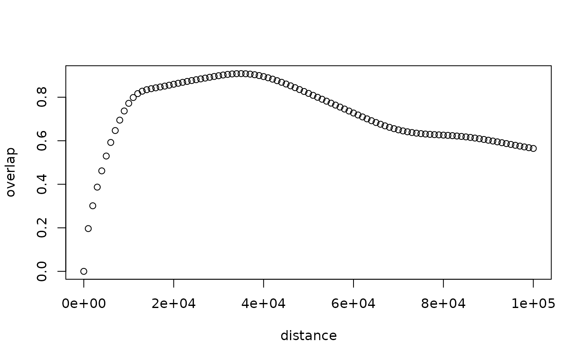

The function first normalizes the vertical profile altitudinal
distribution. This can be either using profile quantity eta or dens,
whichever is preferred (note that dens, the density, is sometimes
thresholded to zero based on radial velocity standard deviation, see
[`sd_vvp_threshold()`](http://adriaandokter.com/bioRad/dev/reference/sd_vvp_threshold.md),
while eta is not)

It then calculates the overlap between the normalized vertical profile,
and the normalized radiation profile as calculated with
[`beam_profile()`](http://adriaandokter.com/bioRad/dev/reference/beam_profile.md),
using a metric called the [Bhattacharyya
distance](https://en.wikipedia.org/wiki/Bhattacharyya_distance). This
metric is zero when there is no overlap, and 1 when the distributions
are identical.

The range-corrected PPI also contains a field `overlap`, which contains
the same metric but then calculated on the grid of the PPI:

``` r

plot(my_corrected_ppi, param = "overlap")
```

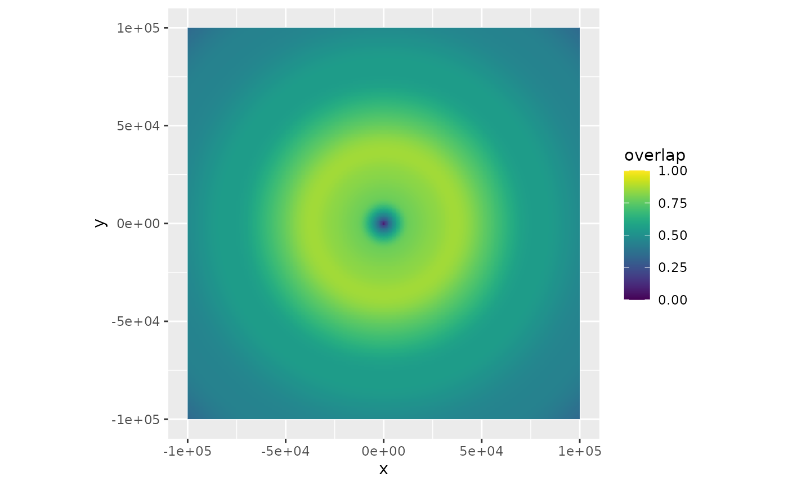

The overlap metric might be used in the future to show only certain
section of the PPI, based on their overlap value.

## 7 To do

- implementation of a `noise_floor` parameter, by which one can
  determine at which distance birds are expected to be below noise
  level, given their vertical profile. Affects function
  [`beam_profile_overlap()`](http://adriaandokter.com/bioRad/dev/reference/beam_profile_overlap.md).
